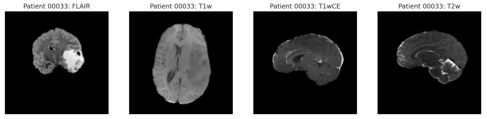

# Brain Tumor Radiogenomic Classification
This is the capstone project for the [Machine Learning Nanodegree](https://www.udacity.com/course/machine-learning-engineer-nanodegree--nd009t) through Udacity. This project is based on the Kaggle competition hosted by the Radiological Society of North America (RSNA). The goal of the this project is to build a model to detect the presence of MGMT promoter methylation in a sequence of magnetic resonance imaging (MRI) sequences. MRI sequences of the brain are taken along three planes: coronal, axial, and sagittal (Figure 1). A typical set MRI sequences will have approximately 400 images. In addition, this project demonstrates the full pipeline of data preparation, feature extraction, and model training on Amazon Web Services (AWS).

## AWS Requirements
This project was completely build on Sagemaker using the following AWS[2](#2) services:
1. Sagemaker Notebook Instance - ml.m4.xlarge
2. S3 Storage - s3://Sagemaker_Notebook_Bucket
3. Training Instance - ml.p2.2xlarge
4. IAM - secrete access key

## Model Requirements
All necessary prep and feature engineering steps are included in the notebook `01_data_exploration.ipynb`. This project uses the 3D-CNN model EfficientNet-3D[3](#3) with some modifications to account for binary classification. Training is done on the GPU instance ml.p2.2xlarge. 

## Code Structure
All source code is located in the main project directory under `./source`. The following directories are included in the project:
1. `./source/helpers.py` - Helper functions for the project to process images and format dataset for training.
2. `./source/train.py` - Training code for the project.
3. `./source/predict.py` - Prediction code for the project.
4. `./source/requirements.txt` - Requirements for loading external libraries on the training instance.

## Data
Data[1](#1) for the project is hosted on S3. It is available for download from from the Kaggle competition page and is approximatly 127 GB with the following structure:

## Running the Notebook
In order to run the notebook and train, all resources must be available on the training instance with access to the S3 bucket that stores the data. 
## References
[1] https://www.kaggle.com/c/rsna-miccai-brain-tumor-radiogenomic-classification/data

[2] https://aws.amazon.com/sagemaker/

[3] https://github.com/shijianjian/EfficientNet-PyTorch-3D/blob/master/example.py